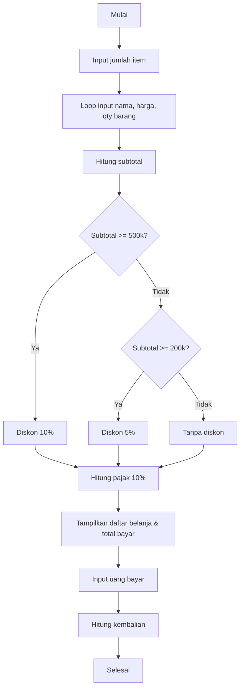

# 📌 Kasir Mini Project

📌 Daftar Anggota Kelompok 

1. Muhammad Fathi Farhat (2567071001)
2. Shendi Adha filian (2507071018)
3. Farsha keysan ariyadi (2507071016)
4. Zelka Ariando (2517051075)

---
Mata Kuliah: Peer grup

## 📖 Latar Belakang

Dalam kehidupan sehari-hari, proses transaksi jual beli sering kali membutuhkan perhitungan yang cepat dan akurat. Program kasir ini dibuat menggunakan bahasa pemrograman **C++** untuk membantu menghitung total belanja, diskon, pajak, dan kembalian secara otomatis. Dengan demikian, program sederhana ini dapat mensimulasikan cara kerja kasir pada toko atau minimarket.

---

## 🎯 Kegunaan Project

* Membantu pengguna menghitung total belanja.
* Memberikan simulasi pemberian diskon otomatis.
* Menambahkan pajak 10% setelah diskon.
* Menampilkan subtotal, total bayar, dan kembalian.

---

## 🔄 Alur Project

1. Pengguna memasukkan jumlah item yang dibeli.
2. Pengguna menginput nama barang, harga, dan jumlah setiap item.
3. Program menghitung subtotal dari semua barang.
4. Program mengecek apakah subtotal mendapat diskon.
5. Setelah diskon, pajak 10% ditambahkan.
6. Program menampilkan daftar belanja, subtotal, total bayar, dan kembalian.

---

## ⚙️ Algoritma Program

1. **Deklarasi variabel** untuk menyimpan nama barang, harga, jumlah, serta konstanta pajak.
2. **Input data** jumlah item, lalu detail tiap barang dengan loop `for`.
3. **Hitung subtotal**: jumlahkan harga × qty untuk setiap barang.
4. **Cek diskon**:

   * Subtotal ≥ 500.000 → diskon 10%
   * Subtotal ≥ 200.000 → diskon 5%
5. **Tambahkan pajak 10%** setelah diskon.
6. **Output** hasil perhitungan: subtotal, total bayar, dan kembalian.

---

## 🖼️ Flowchart



---

## ✨ Fitur Utama

* Input barang dinamis (hingga 50 item).
* Perhitungan otomatis subtotal, diskon, pajak, dan kembalian.
* Diskon berdasarkan nominal belanja.
* Output daftar belanja lengkap.

---

## 🖥️ Simulasi Penggunaan

### Input:

```
Masukkan jumlah item: 2

Item ke-1
Nama barang  : Buku
Harga barang : 20000
Jumlah       : 2

Item ke-2
Nama barang  : Pensil
Harga barang : 5000
Jumlah       : 5
```

### Output:

```
===== DAFTAR BELANJA =====
Buku x2 = Rp40000
Pensil x5 = Rp25000

Subtotal : Rp65000
Total Bayar (setelah diskon & pajak): Rp71500
Uang dibayarkan: Rp100000
Kembalian      : Rp28500

Terima kasih telah berbelanja!
```

---

